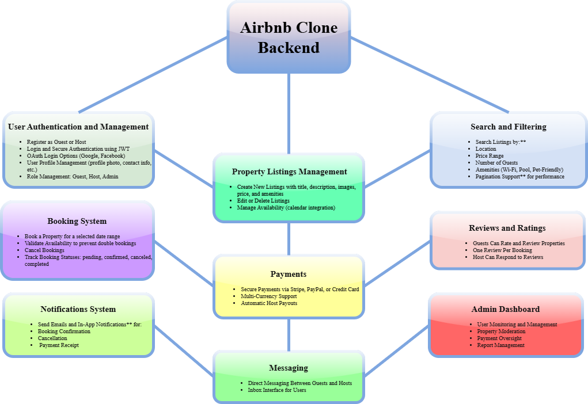

# Airbnb Clone – Features and Functionalities

This document outlines the key backend features and functionalities required for the Airbnb Clone project. The backend is responsible for handling user data, property listings, bookings, reviews, messaging, and administrative tasks.

---

## 1. User Authentication and Management

- **Register as Guest or Host**
- **Login and Secure Authentication** using JWT
- **OAuth Login Options** (Google, Facebook)
- **User Profile Management** (profile photo, contact info, etc.)
- **Role Management:** Guest, Host, Admin

---

## 2. Property Listings Management

- **Create New Listings** with title, description, images, price, and amenities
- **Edit or Delete Listings**
- **Manage Availability** (calendar integration)

---

## 3. Search and Filtering

- **Search Listings by:**
  - Location
  - Price Range
  - Number of Guests
  - Amenities (Wi-Fi, Pool, Pet-Friendly)
- **Pagination Support** for performance

---

## 4. Booking System

- **Book a Property** for a selected date range
- **Validate Availability** to prevent double bookings
- **Cancel Bookings**
- **Track Booking Statuses**: pending, confirmed, canceled, completed

---

## 5. Payments

- **Secure Payments** via Stripe, PayPal, or Credit Card
- **Multi-Currency Support**
- **Automatic Host Payouts**

---

## 6. Reviews and Ratings

- **Guests Can Rate and Review** Properties
- **One Review Per Booking**
- **Host Can Respond** to Reviews

---

## 7. Notifications System

- **Send Emails and In-App Notifications** for:
  - Booking Confirmation
  - Cancellation
  - Payment Receipt

---

## 8. Messaging

- **Direct Messaging Between Guests and Hosts**
- **Inbox Interface for Users**

---

## 9. Admin Dashboard

- **User Monitoring and Management**
- **Property Moderation**
- **Payment Oversight**
- **Report Management**
